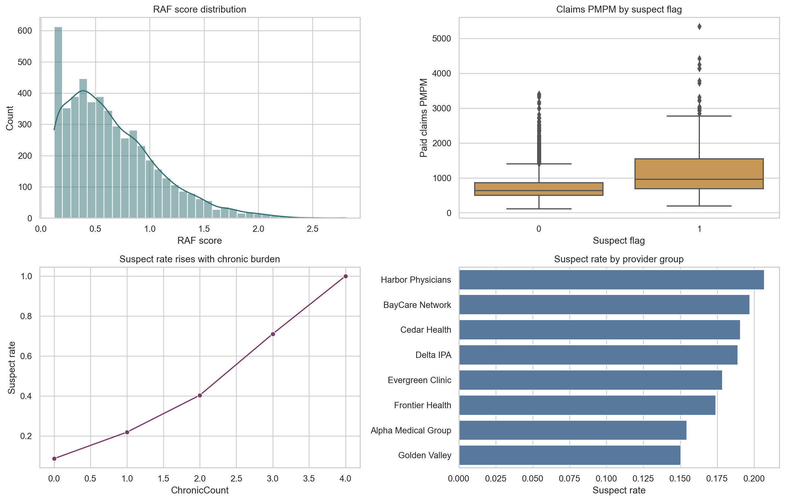
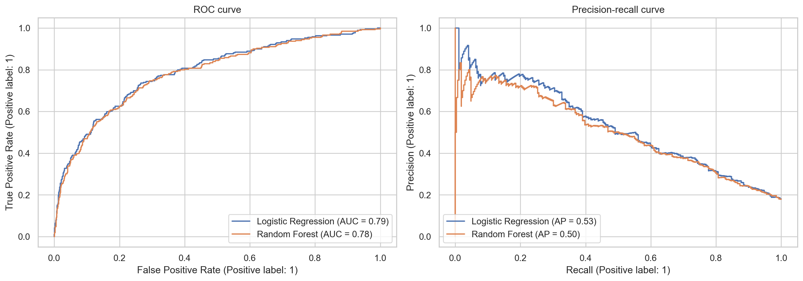
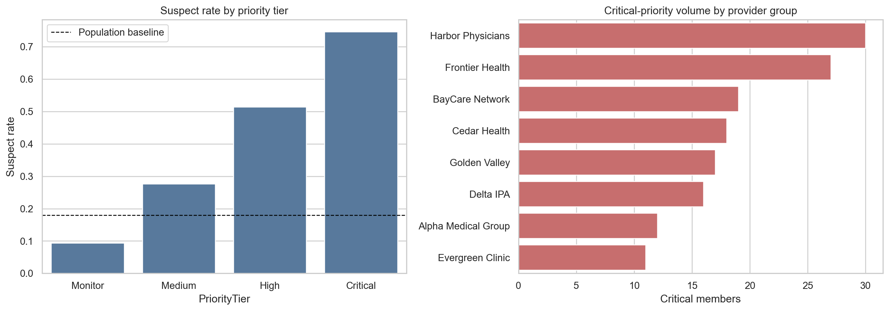
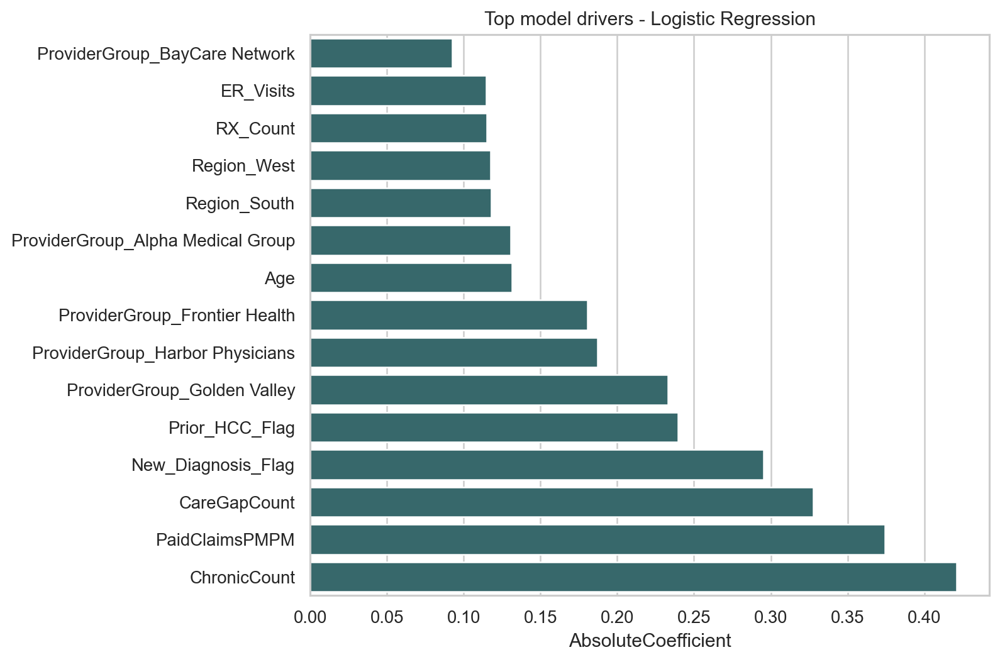

# 🏥 Healthcare Risk Adjustment Analytics App

### Turning synthetic payer data into a decision-ready risk adjustment review workflow

[](https://share.streamlit.io/deploy?repository=https://github.com/BIRJUNG/healthcare-risk-command-center&branch=main&mainModule=streamlit_app.py)


---

## 👤 Built By

**Birjung Thapa**  
Data Scientist | Healthcare Analytics | Machine Learning  
Sacramento, California

- LinkedIn: [linkedin.com/in/birjungthapa](https://www.linkedin.com/in/birjungthapa)
- GitHub: [github.com/BIRJUNG](https://github.com/BIRJUNG)

---

## 📌 About This Project

This repository is an end-to-end healthcare analytics portfolio project.

The project simulates a payer-side risk adjustment workflow where a health plan needs to identify members who should be prioritized for documentation review, care-gap outreach, and provider follow-up.

The goal is not just to build a model. The goal is to show how a data scientist or healthcare analyst can move from:

1. business problem
2. synthetic healthcare data
3. exploratory analysis
4. predictive modeling
5. operational prioritization
6. financial interpretation
7. Streamlit decision-support app
8. interview-ready explanation

The dataset is fully synthetic and HIPAA-safe. No real patient, claims, or PHI data is used.

---

## 🎯 Business Problem

Health plans cannot review every member manually.

Risk adjustment, quality, and provider operations teams need a way to answer:

- Which members should be reviewed first?
- Which provider groups have concentrated documentation opportunities?
- How much value could a chart-review sprint create?
- Which plan segments may have risk-transfer exposure?
- What model signals are driving the prioritization?

This project solves that problem by creating a ranked review queue and an interactive Streamlit command center.

---

## 💡 Why I Built This

I built this project to show practical healthcare data science, not only generic machine learning.

Many portfolio projects stop at model accuracy. This project goes further by connecting model output to a real operational workflow:

- chart review prioritization
- provider action planning
- care-gap follow-up
- plan-level financial interpretation
- scenario scoring for individual members

That makes the project useful for roles like:

- Healthcare Data Analyst
- Healthcare Data Scientist
- Risk Adjustment Analyst
- Clinical Data Analyst
- Population Health Analyst
- Payer Analytics Analyst
- Healthcare BI Analyst

---

## 🚀 Streamlit App

The Streamlit app is the main user-facing product.

It is designed as a modern dark-glass healthcare operations dashboard with guided presets, animated cards, model explainability, downloadable worklists, and personal branding.

### App Capabilities

- Choose workflow presets:
  - Executive overview
  - Chart review sprint
  - Provider outreach
  - Care gap cleanup
- Filter by:
  - region
  - plan
  - provider group
  - age range
  - priority tier
  - suspect probability
- Simulate monthly review capacity
- Estimate gross opportunity, review cost, and net review value
- Download prioritized member worklists
- Inspect provider workload concentration
- Explain model drivers
- Score a single member scenario interactively

### Deployment Settings

Use these fields on Streamlit Community Cloud:

```text
Repository: BIRJUNG/healthcare-risk-command-center
Branch: main
Main file path: streamlit_app.py
Python version: 3.11
Dependency file: requirements.txt
```

If Streamlit does not detect the repo manually, use **Paste GitHub URL** and paste:

```text
https://github.com/BIRJUNG/healthcare-risk-command-center/blob/main/streamlit_app.py
```

---

## 📊 Key Results

| Metric | Result |
|---|---:|
| Synthetic members | 5,000 |
| Suspect member rate | 17.9% |
| Best model | Logistic Regression |
| ROC AUC | 0.792 |
| Average precision | 0.526 |
| Top-decile lift | 3.49x |
| Top-decile capture | 34.9% |
| Critical-tier suspect rate | 74.7% |
| Critical-tier average claims PMPM | $2,068 |

---

## 🧠 What Makes This Project Different

This is not just a notebook with charts.

This project is built like a real healthcare analytics product:

- The dataset is synthetic but domain-informed.
- The notebook explains the business and technical reasoning.
- The model is evaluated with metrics that match review-queue workflows.
- The app turns predictions into actions.
- The README and interview guide explain how to present the project professionally.

The project shows both technical ability and healthcare domain thinking.

---

## 🏗️ Repository Structure

```text
healthcare-risk-command-center/
|
|-- streamlit_app.py
|-- README.md
|-- PROFILE_PROJECT_SNIPPETS.md
|-- requirements.txt
|-- requirements-dev.txt
|-- runtime.txt
|
|-- .streamlit/
|   `-- config.toml
|
|-- src/
|   |-- __init__.py
|   `-- risk_adjustment_pipeline.py
|
|-- notebooks/
|   `-- Healthcare_Risk_Adjustment_Analytics.ipynb
|
|-- data/
|   `-- synthetic_healthcare_risk_members.csv
|
|-- outputs/
|   |-- model_metrics.csv
|   |-- feature_importance.csv
|   |-- priority_tier_summary.csv
|   |-- provider_action_table.csv
|   |-- plan_risk_transfer_summary.csv
|   |-- scored_member_priority_queue.csv
|   |-- top_25_member_opportunities.csv
|   `-- figures/
|
`-- reports/
    |-- PORTFOLIO_CASE_STUDY.md
    `-- INTERVIEW_NOTEBOOK_WALKTHROUGH.md
```

---

## 🔬 Analytics Workflow

### 1. Generate Synthetic Healthcare Data

The project creates a HIPAA-safe member population with payer-style fields:

- demographics
- regions
- provider groups
- plan IDs
- member months
- actuarial value
- utilization
- chronic conditions
- care gaps
- RAF score
- claims PMPM
- suspect documentation flag

### 2. Explore Risk Patterns

The notebook analyzes:

- RAF distribution
- claims PMPM distribution
- chronic burden
- suspect rate by provider
- care-gap concentration
- relationship between utilization and risk

### 3. Train Predictive Models

The project compares:

- Logistic Regression
- Random Forest

The best model is selected using healthcare-relevant ranking metrics.

### 4. Evaluate With Operational Metrics

The project uses:

- ROC AUC
- average precision
- precision and recall
- top-decile lift
- top-decile capture

Top-decile lift matters because a risk adjustment team usually has limited review capacity.

### 5. Convert Scores Into Action

The model output becomes:

- suspect probability
- member rank
- priority tier
- estimated opportunity PMPM
- provider action table
- review worklist
- plan risk-transfer summary

---

## 📈 Visual Outputs

### EDA Risk Signals



### Model ROC and Precision-Recall Curves



### Priority Queue Summary



### Feature Importance



---

## 🧪 How To Run Locally

### Run the Streamlit App

```bash
python3 -m venv .venv
source .venv/bin/activate
pip install -r requirements.txt
streamlit run streamlit_app.py
```

Then open:

```text
http://localhost:8501
```

### Run the Notebook

```bash
python3 -m venv .venv
source .venv/bin/activate
pip install -r requirements-dev.txt
jupyter notebook notebooks/Healthcare_Risk_Adjustment_Analytics.ipynb
```

---

## 🧾 Main Files Explained

| File | Purpose |
|---|---|
| `streamlit_app.py` | Interactive healthcare risk command center |
| `src/risk_adjustment_pipeline.py` | Reusable data generation, modeling, scoring, and reporting functions |
| `notebooks/Healthcare_Risk_Adjustment_Analytics.ipynb` | Full project notebook with business explanation and code |
| `reports/INTERVIEW_NOTEBOOK_WALKTHROUGH.md` | Interview explanation and code walkthrough |
| `outputs/model_metrics.csv` | Model comparison results |
| `outputs/scored_member_priority_queue.csv` | Full scored member worklist |
| `outputs/provider_action_table.csv` | Provider-level action planning output |

---

## 🗣️ Interview Pitch

> I built a healthcare risk adjustment analytics app that simulates a payer-side member population, predicts which members should be prioritized for documentation review, and turns model output into an operational Streamlit dashboard. The project includes synthetic healthcare data generation, EDA, model comparison, ranking metrics, provider action tables, plan-level financial interpretation, and an interactive member-scenario scoring tool.

Short version:

> This project shows how I use data science to move from healthcare data to business action.

---

## ✅ Skills Demonstrated

- Python
- pandas
- NumPy
- scikit-learn
- Streamlit
- Plotly
- healthcare analytics
- risk adjustment
- RAF score interpretation
- HCC-style documentation logic
- claims/utilization analytics
- predictive modeling
- model evaluation
- feature importance
- ranked-list prioritization
- dashboard design
- business storytelling

---

## ⚠️ Limitations

This project is a synthetic portfolio project.

It is not a production risk adjustment model and should not be interpreted as a certified CMS, ACA, or payer payment model. In a real environment, the workflow would require:

- real claims and encounter data
- clinical validation
- compliance review
- subgroup fairness checks
- model calibration
- monitoring for drift
- feedback loops from actual chart review outcomes

---

## 🌱 Long-Term Goal

The long-term goal is to turn this project into a strong healthcare analytics portfolio asset that demonstrates:

- domain understanding
- technical modeling ability
- product thinking
- communication skill
- interview readiness

This project is built to show that I can not only write code, but also explain why the code matters.

---

## 🔗 Connect With Me

- LinkedIn: [linkedin.com/in/birjungthapa](https://www.linkedin.com/in/birjungthapa)
- GitHub: [github.com/BIRJUNG](https://github.com/BIRJUNG)

---

## ⭐ Final Note

This repository is meant to be easy to read, easy to run, and easy to explain in an interview.

The project connects healthcare domain logic with data science, and turns the output into a real decision-support experience.

Thanks for visiting this project.
